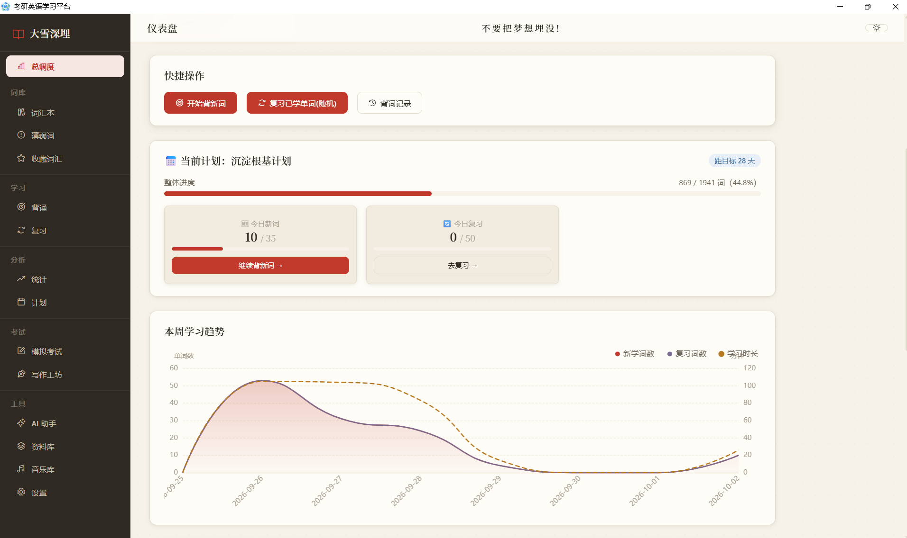

# 考研英语学习平台（v3.3.0）

基于 Django 的考研英语一体化学习应用，现已打包为 **Windows 单文件桌面客户端**（原生窗口、无黑框、无需浏览器、无需装 Python），覆盖 **词汇背诵 · 复习巩固 · 写作工坊 · 真题模拟 · 音乐与资料库**，开箱即用。

> **一句话介绍**：先背单词、再写作文，背得越多，写作越占便宜。
>
> 1. **背单词**：按单元背诵、自动安排复习、薄弱词重点练，每天打卡保持节奏。
> 2. **写作文**：系统记录你已掌握的词汇，写作工坊据此生成**专属于你当前词汇水平的范文与作文模板**（高分句型、易错点、词汇升级卡），并逐句批改打分。
>
> 一句话：**积累的词汇越多，生成的范文和模板就越贴合你的水平**，形成你自己的写作套路。

<p align="center">
  
</p>


## 功能特性

### 🖥️ 桌面客户端（v3.3.0 重点）
- **单文件免安装**：一个 `word.exe` 双击即用
- **首启自动初始化**：约 1 分钟自动建库并导入 1941 词词库与 153 条历年真题，零配置
- **程序与数据分离**：exe 内只含代码与词库，学习数据独立保存在 exe 同目录 `data/`；升级只需替换 exe，旧数据不受影响

### 📚 词汇学习
- **完整词库**：1941 词 / 27 单元，全库 100% 配中英双语例句；支持单元管理、分页浏览与自行扩展导入
- **背诵**：顺序 / 乱序背诵，自由设置背诵总数与每批数量、按批推进，今日任务一键按「目标 − 已学」自动补量
- **复习调度**：按「昨日背错 → 昨日新学 → 今日到期 → 其余已学」自动排队，支持随机抽查、错词再练一轮

### ✍️ 考研写作工坊（核心特色）
- **真题库**：英语一 / 英语二 2006–2026 年小作文、大作文、翻译真题，外加六级翻译真题
- **词汇画像驱动代写**：自动读取你已掌握的词汇画像，生成严格贴合当前词汇水平的作文（基础 / 标准 / 拔高三档），不用超纲词堆砌
- **作文批改**：词汇 / 语法 / 连贯 / 切题 / 丰富度五维评分 + 逐句改错 + 高级表达推荐
- **专属模板沉淀**：根据练习历史生成属于你自己的高分句型、易错点与词汇升级卡
- **翻译专项**：长难句语法拆解、词汇点拨、译文批改
- **命题规律分析**：基于历年真题归纳高频主题与常考题型
- **练习历史**：完整留存每次写作与翻译练习，可随时回看对比


## 技术栈

- **后端**：Python 3.13 + Django 4.2，SQLite 单文件数据库
- **桌面端**：pywebview（系统自带 WebView2 内核），PyInstaller 打包为单 exe
- **前端**：原生 HTML / CSS / JS，无构建工具；ECharts 本地打包离线可用、Phosphor Icons
- **PDF 导出**：reportlab（学习报告 / 真题资料导出）

### 技术亮点

- **词汇画像驱动的写作闭环**：以「已掌握单词」为输入构建用户词汇画像，范文与专属模板严格落在用户当前词汇水平内，背词与写作相互喂养
- **真正的单文件桌面化**：程序与用户数据分离、首启自动迁移建库、固定端口保证本地数据跨启动保留；音乐在无 ffmpeg 机器上自动降级为原文件直放
- **纯前端离线交互**：图表与图标全部本地打包，Django 模板 + 原生 JS 即可运行，零前端构建依赖

## 快速开始

### 桌面客户端（推荐）

下载 `word.exe` 后双击，弹出原生桌面窗口即可使用；首次启动约 1 分钟自动建库并导入词库与真题。

学习数据保存在 `word.exe` 同目录的 `data/` 文件夹中，更换电脑或重装前请先在设置页备份；启动异常可查看 `data/launch.log`。

### 开发模式

```
pip install -r requirements.txt
python manage.py migrate
python manage.py runserver
```

浏览器打开 http://127.0.0.1:8000/

## AI 模型配置

在 `/settings/` 页面添加模型并填写接口信息即可使用写作工坊、默写判定等智能能力；可为不同用途分别指定模型，未指定时自动使用第一个启用的模型，并提供一键连通性检测。

## 项目结构

```
d:\word
├── manage.py
├── requirements.txt
├── vocab_project/      # Django 配置（含版本号 APP_VERSION）
├── words/              # 主应用（模型 / 视图 / 模板 / 静态资源）
├── data/               # 词库源数据（打包进 exe，首启自动导入）与 README 展示截图
├── ioc/                # 应用图标
├── 001/                # 桌面打包：launch.py 入口、word.spec、dist/word.exe
└── backups/            # 备份目录
```


